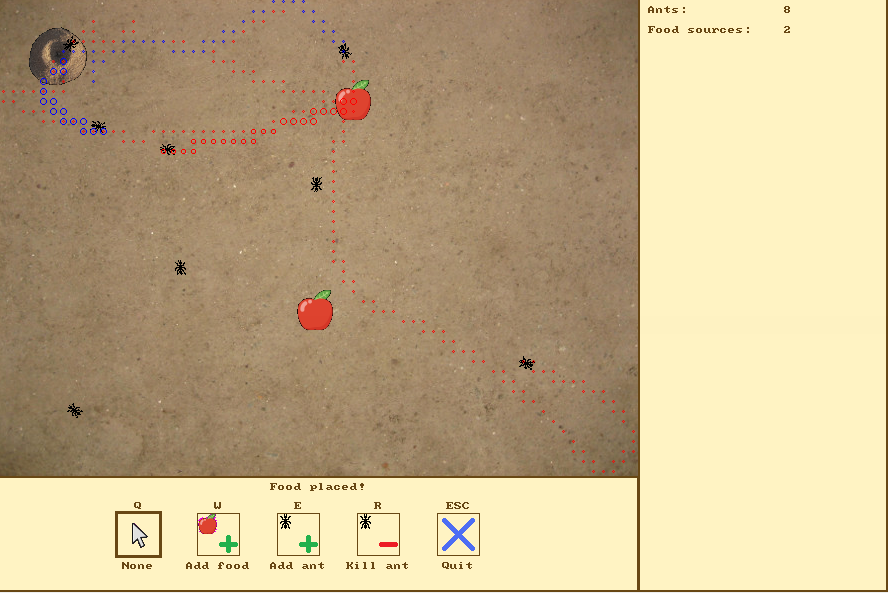

# Ants

*Ants* simulates a colony of ants wandering across a field in search of food. They communicate with each other by releasing pheromones, whose smell guides the little creatures towards the coveted meal.

## Install dependencies

This application requires Allegro4 to run. The suggested way to install is:

`sudo apt-get install liballegro4.4 liballegro4-4dev`

## Download

`git clone https://https://github.com/leoll2/RealTime.git`

## Compile

`mkdir bin build`

`make all`

## Launch

`bin/main`

